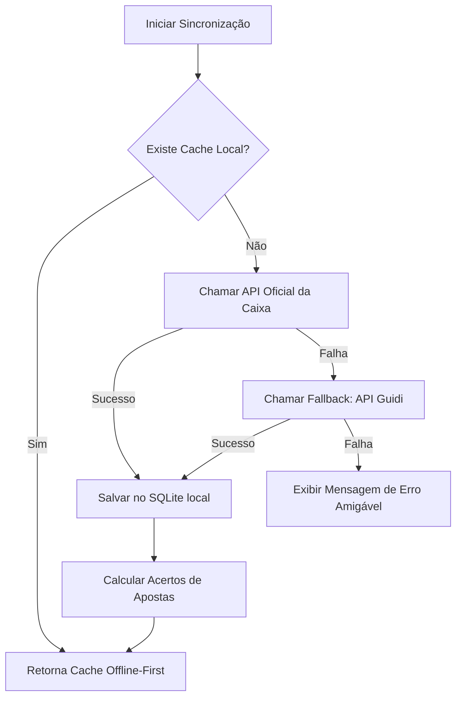

# 🔌 Integração de APIs e Resiliência - MegaSena Monitor

Para entregar uma experiência offline-first contínua e sem atrito, o **MegaSena Monitor** executa um fluxo automatizado de sincronização que consome dados de fontes externas, lidando com instabilidades de rede por meio de políticas de fallback inteligentes e exploração proativa de dados.

---

## 🏛️ Fluxo de Sincronização



---

## 📡 Detalhes das Fontes de Dados

### 1. API Oficial Loterias Caixa (Fonte Principal)
* **URL**: `https://servicebus2.caixa.gov.br/portaldeloterias/api/megasena/{concurso}`
* **Headers Necessários**: Requer um `User-Agent` de navegador comum de forma a passar pelo controle de segurança e evitar códigos de status `403 Forbidden`.
  * *User-Agent padrão em uso:* `Mozilla/5.0 (Macintosh; Intel Mac OS X 10_15_7) AppleWebKit/537.36 (KHTML, like Gecko) Chrome/119.0.0.0 Safari/537.36`
* **Timeout**: Configurado em **10 segundos** para evitar travamentos em threads de rede bloqueantes.

### 2. API Guidi (Fonte de Fallback)
* **URL**: `https://api.guidi.dev.br/loteria/megasena/{concurso}`
* **Características**: API Open Source comunitária e de alta disponibilidade. O payload retornado é modelado de forma a possuir exatamente os mesmos campos da API Oficial da Caixa, simplificando a deserialização direta sob a mesma estrutura Rust.

---

## 📦 Estrutura de Payload de Entrada (JSON)

As APIs retornam um modelo robusto estruturado que é mapeado pela struct `CaixaApiResponse` no arquivo `src-tauri/src/api.rs`:

```json
{
  "numero": 2650,
  "dataApuracao": "28/10/2023",
  "listaDezenas": ["05", "12", "32", "38", "52", "58"],
  "acumulado": false,
  "listaRateioPremio": [
    {
      "numeroDeGanhadores": 1,
      "valorPremio": 500000.0,
      "descricaoFaixa": "6 acertos"
    },
    {
      "numeroDeGanhadores": 40,
      "valorPremio": 12000.0,
      "descricaoFaixa": "5 acertos"
    }
  ],
  "valorEstimadoProximoConcurso": 3000000.0,
  "valorAcumuladoProximoConcurso": 0.0
}
```

---

## 🔮 Estratégia de Exploração de Fronteira

Dias especiais de grandes sorteios (como a **Mega da Virada** ou concursos muito acumulados) geram um congestionamento imenso nos servidores da Caixa, o que faz com que a rota da âncora principal (`/api/megasena/`) demore para se atualizar, mesmo após o sorteio já ter ocorrido e os resultados estarem disponíveis nas rotas individuais de concurso.

Para sanar este problema e antecipar o resultado, o MegaSena Monitor emprega a **Exploração de Fronteira**:

1. Busca-se o número oficial mais recente retornado pelo endpoint âncora padrão (ex: concurso `2954`).
2. O algoritmo tenta ativamente forçar uma requisição direta para o concurso imediatamente seguinte (`anchor + 1`, ex: `2955`).
3. Se a busca direta retornar dados válidos com sucesso:
   * Deduz-se que a API centralizada está desatualizada, mas os resultados individuais já estão online.
   * A âncora de exibição local é promovida para `anchor + 1`.
   * O algoritmo tenta repetidamente fazer um teste extra de duplo avanço para `anchor + 2`.
4. Isso garante que o usuário obtenha o resultado do concurso atualizado quase imediatamente após o sorteio oficial ser publicado pela Caixa, antes mesmo dos portais atualizarem a página principal.

---

## 🛡️ Políticas de Resiliência de Rede

1. **Cliente Unificado (`fetch_and_parse_api`)**: Reduz a possibilidade de falhas estruturais, centralizando o controle de timeout de conexão e as tratativas de conversão de caracteres.
2. **Silenciamento Parcial de Erros de Lote**: Ao carregar múltiplos resultados históricos (ex: lote de 36 concursos passados), o sistema loga os erros individuais de concursos inexistentes no terminal, mas **não bloqueia a renderização da tela do usuário** com alertas invasivos.
3. **Cache de Persistência Imediata**: Toda resposta bem-sucedida recebida da internet é instantaneamente gravada no SQLite. Consultas subsequentes para aquele mesmo concurso nunca mais gastam recursos de rede.
