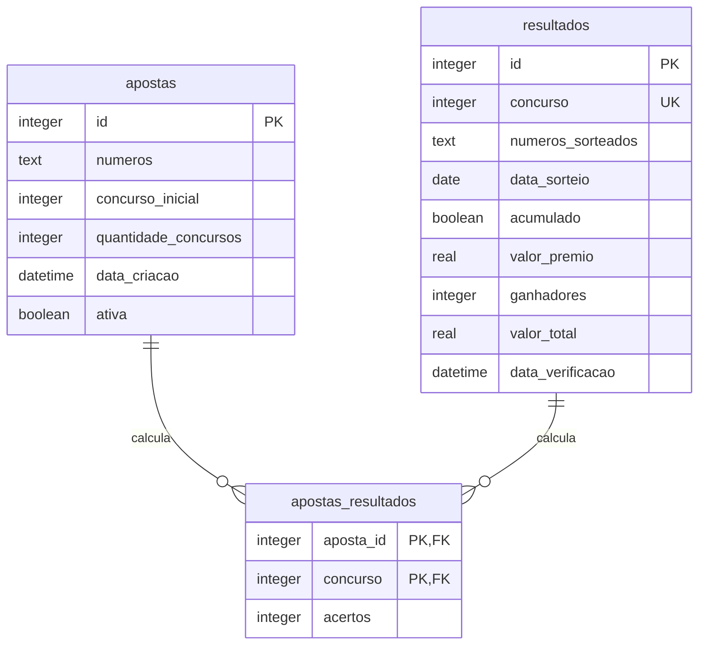

# 🗄️ Guia de Banco de Dados - MegaSena Monitor

O **MegaSena Monitor** é um aplicativo desktop *offline-first*. Toda a persistência de dados ocorre inteiramente na máquina local do usuário usando um banco de dados **SQLite** embarcado via biblioteca `rusqlite` no backend Rust.

---

## ⚙️ Configurações do Banco de Dados

* **Mecanismo**: SQLite 3
* **Conexão**: Gerenciada pelo backend Rust através do estado global unificado `State<'_, Mutex<Database>>`.
* **Pragmas Ativados**:
  * `PRAGMA foreign_keys = ON;` (Garante a integridade referencial e deleções em cascata).

### Caminho de Armazenamento Local

O banco de dados é gravado no diretório de dados padrão da aplicação do sistema operacional (`App Data Directory`), sob o nome `megasena.db`:

* **macOS**: `~/Library/Application Support/com.zedicoes.megasena/megasena.db`
* **Windows**: `C:\Users\<Usuario>\AppData\Roaming\com.zedicoes.megasena\megasena.db`
* **Linux**: `~/.local/share/com.zedicoes.megasena/megasena.db`

---

## 🗺️ Modelo de Dados (Schema)



### 1. Tabela `apostas`

Armazena as dezenas escolhidas pelo usuário e o escopo de concursos para os quais o jogo é válido (Teimosinha).

| Coluna | Tipo | Restrições | Descrição |
| :--- | :--- | :--- | :--- |
| `id` | `INTEGER` | PRIMARY KEY AUTOINCREMENT | Identificador único da aposta. |
| `numeros` | `TEXT` | NOT NULL | Array JSON contendo de 6 a 20 dezenas ordenadas (ex: `"[1,9,37,39,42,44]"`). |
| `concurso_inicial` | `INTEGER` | NOT NULL | Primeiro concurso de validade da aposta. |
| `quantidade_concursos`| `INTEGER` | NOT NULL | Quantidade de sorteios consecutivos de validade (1, 2, 4, 8 ou 12). |
| `data_criacao` | `DATETIME`| DEFAULT `CURRENT_TIMESTAMP` | Data e hora de criação da aposta em UTC. |
| `ativa` | `BOOLEAN` | DEFAULT `1` | Define se a aposta ainda está sendo monitorada. |

---

### 2. Tabela `resultados`

Cache local para guardar os resultados oficiais dos sorteios. Evita chamadas repetidas às APIs externas e permite o funcionamento 100% offline.

| Coluna | Tipo | Restrições | Descrição |
| :--- | :--- | :--- | :--- |
| `id` | `INTEGER` | PRIMARY KEY AUTOINCREMENT | ID interno de registro. |
| `concurso` | `INTEGER` | NOT NULL UNIQUE | Número do concurso oficial (ex: `2650`). |
| `numeros_sorteados` | `TEXT` | NOT NULL | Array JSON contendo os 6 números sorteados (ex: `"[5,12,32,38,52,58]"`). |
| `data_sorteio` | `DATE` | - | Data em que o sorteio ocorreu (formato string pt-BR). |
| `acumulado` | `BOOLEAN` | - | Indica se o prêmio principal acumulou. |
| `valor_premio` | `REAL` | - | Valor pago para ganhadores com 6 acertos (Sena). |
| `ganhadores` | `INTEGER` | - | Número de ganhadores na Sena. |
| `valor_total` | `REAL` | - | Estimativa total de prêmios ou valor acumulado do concurso. |
| `data_verificacao` | `DATETIME`| DEFAULT `CURRENT_TIMESTAMP` | Carimbo de data/hora em que a API local de cache foi populada. |

---

### 3. Tabela `apostas_resultados` (Tabela de Junção)

Cacheia a contagem de acertos calculada de cada aposta individual contra concursos específicos verificados. Possui chaves estrangeiras com ação em cascata (`ON DELETE CASCADE`).

| Coluna | Tipo | Restrições | Descrição |
| :--- | :--- | :--- | :--- |
| `aposta_id` | `INTEGER` | PRIMARY KEY, FK -> `apostas(id)` | Identificador da aposta. |
| `concurso` | `INTEGER` | PRIMARY KEY, FK -> `resultados(concurso)`| Concurso conferido. |
| `acertos` | `INTEGER` | NOT NULL | Quantidade de acertos encontrados (0 a 6). |

---

## 🔄 Fluxo de Migrações de Schema

Para evitar bibliotecas de migração externas complexas, o MegaSena Monitor realiza migrações dinâmicas nativas escritas em SQL cru no método de inicialização `init()` da struct `Database` (`src-tauri/src/database.rs`):

```rust
// Migrações manuais para colunas novas caso a tabela de resultados já exista no cliente
let _ = self.conn.execute("ALTER TABLE resultados ADD COLUMN valor_premio REAL", []);
let _ = self.conn.execute("ALTER TABLE resultados ADD COLUMN ganhadores INTEGER", []);
let _ = self.conn.execute("ALTER TABLE resultados ADD COLUMN valor_total REAL", []);
```

### Regras para Evolução de Schema:
1. **Idempotência**: Sempre use cláusulas `CREATE TABLE IF NOT EXISTS`.
2. **Ignorar Erros Controlados**: Adições de novas colunas via `ALTER TABLE` devem ignorar os erros gerados caso as colunas já existam nas execuções subsequentes.
3. **Não Destrutivo**: Nunca exclua tabelas ou altere tipos de dados de colunas existentes de forma a quebrar compatibilidade reversa com os dados locais salvos do usuário.

---

## 💾 Procedimento de Backup Manual

Para salvar ou transferir suas apostas para outro computador:

1. Feche o aplicativo **MegaSena Monitor**.
2. Navegue até o diretório de dados correspondente ao seu SO (mencionado no início deste documento).
3. Copie o arquivo `megasena.db` para um local seguro (drive externo, nuvem, etc.).
4. Para restaurar, basta colar o arquivo `megasena.db` de volta na mesma pasta de destino do novo computador, substituindo o arquivo existente antes de iniciar o aplicativo.
